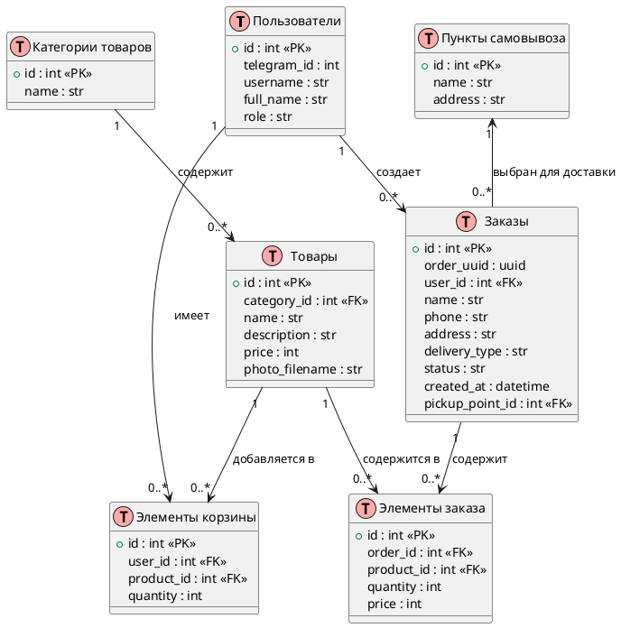

# shop_bot

## Описание проекта
Это Telegram бот для интернет-магазина с полным циклом покупки товаров.
Пользователи могут просматривать каталог товаров, добавлять товары в корзину, оформлять заказы, а администратор управлять товарами и заказами.

## Развертывание

Клонировать репозиторий
```
git clone git@github.com:Gustcat/shop_bot.git
```
в .env файле указать токен бота и параметры подключения к базе данных
```
cd shop_bot/.env
```
При изменении параметров подключения к базе данных, необходимо изменить переменную sqlalchemy.url в файле alembic.ini.  
Для этого можно использовать команду из корневой директории:
```
make init_alembic
```

В корневой директории проекта запустите сборку сети контейнеров:
```
sudo docker compose up -d
```
Перейти внутрь контейнера бэкенда:
```
docker-compose exec backend bash
```
Применить существующие миграции:
```
alembic upgrade head
```

## Технологии

- Python 3.11
- Aiogram 3.22
- PostgreSQL 15
- Docker

## Архитектура проекта

Проект разделён на несколько логических компонентов:

### Основные папки и файлы

- `bot.py` — точка входа, запускает бота и подключение к базе данных.
- `config.py` — хранит конфигурацию проекта (токен бота, URL базы данных и т.д.).
- `db.py` — настройка асинхронного подключения к PostgreSQL через SQLAlchemy.
- `middlewares.py` — содержит middleware для проверки, является ли пользователь администратором.
- `handlers/` — хэндлеры Telegram бота, разделены по функционалу:
  - `catalog.py` — работа с каталогом товаров
  - `cart.py` — работа с корзиной
  - `order.py` — оформление заказов
  - `admin.py` — административная панель
  - `main_menu.py` — главное меню бота
- `keyboards/` — inline-клавиатуры для взаимодействия пользователя с ботом:
  - `catalog_kb.py`, `cart_kb.py`, `order_kb.py`, `admin_kb.py`, `main_menu_kb.py`
- `media/` — 
  - `products/` — хранение загружаемых изображений товаров
- `utils.py` — вспомогательные функции:
  - форматирование цен
  - генерация и отправка сообщений одинакового формата
- `alembic/` — миграции базы данных
## Схема базы данных




## Автор
https://github.com/Gustcat